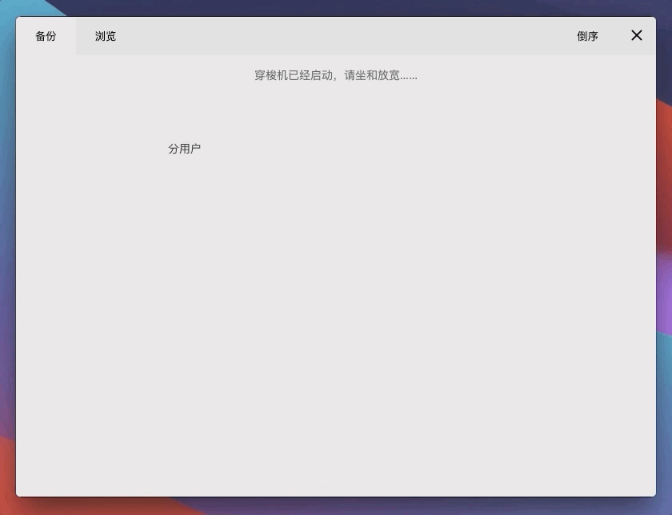
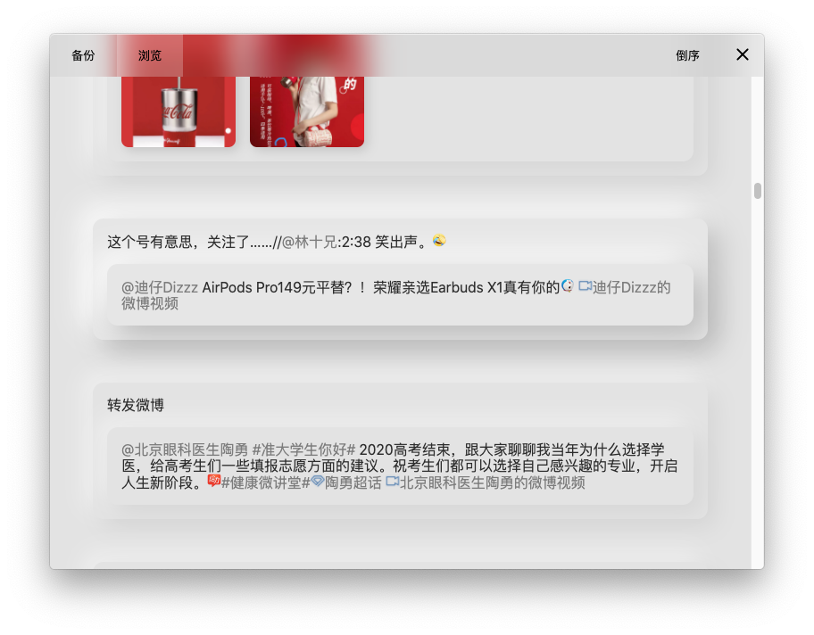

    

<h2 align="center">Weibo Backup Museum</h2>
<h4 align="center">微博博物馆 - 简单好看的微博备份+浏览软件</h4>
 

- **跨平台：** 基于 Electron，支持各种桌面操作系统
- **增量备份：** 自动跳过已经备份过的微博，随时、随意备份
- **无需登录：** 目前使用 m.weibo.cn API，无需登录即可备份。（将来会推出登录功能以方便备份私密微博）
- **浏览：** 自带美观好用、无限滚动的浏览功能，最快速抵达记忆深处～
- **保存最原始的数据：** 保存下来的数据未经加工，以尽量避免信息丢失

    
    

 

## 下载地址
https://github.com/z1a/weibo-backup-museum/releases

## 使用说明

- 简单来说，输入用户昵称后就会自动开始备份，备份完毕后就可以浏览啦！
- 备份完毕之后，再次进入备份界面可以更新备份，这时只会下载上次备份之后新发的微博。
- 所有备份的文件都储存在用户目录的`Documents (文档)` - `weibo-museum`下。`data`中保存了原始的用户文字数据，`assets`中保存了所有的图片。`data`中文件可能比较多，如果想长期放在移动硬盘保存，可以先打包压缩一下加快拷贝速度。
- 如果想要重新输入用户昵称，可以删除`weibo-museum` - `data` - `meseum-config`文件。备份新用户并不会导致之前的备份数据丢失，如果把用户名换回来还是可以继续增量备份之前的用户数据。

## 可能会添加的功能

- 登录功能
- 备份评论
- 备份、浏览视频
- 显示日期、头像
- 导出 html
- 快速跳转至特定时间

## 开发

1. 本地需安装 Node.js 和 Yarn （目前 Electron 不支持 Yarn v2，v1 的安装详见[这里](https://classic.yarnpkg.com/en/docs/install)）
2. clone 之后，运行`yarn`安装依赖。然后运行`yarn build`，最后运行`yarn start`即可使用。

有 bug、改进意见欢迎提 issue 和 PR，谢谢。
